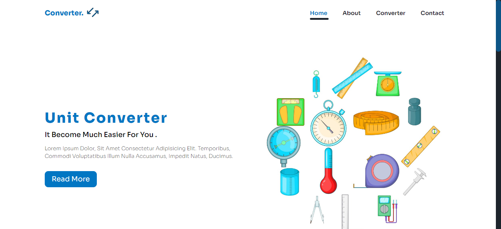

# CodeClause Internship Project

  unit converter project

## Table of contents

- [Overview](#overview)
  - [The challenge](#the-challenge)
  - [Screenshot](#screenshot)
  - [Links](#links)
- [My process](#my-process)
  - [Built with](#built-with)
  - [What I learned](#what-i-learned)
  - [Useful resources](#useful-resources)
- [Author](#author)

## Overview

### The challenge

Users should be able to:

- View the optimal layout for the interface depending on their device's screen size
- See hover and focus states for all interactive elements on the page
- **Bonus**: Toggle the mobile menu (requires some JavaScript)
- convert any type of units they need like (length , weight , power , time ... and so on)

### Screenshot

this screenshot for the home page of the website

### Links
  you can see dem live for the project from link below 
- Live Site URL: 

## My process

### Built with

- Semantic HTML5 markup
- CSS custom properties
- javascript
- scss preprocessor for css 
- Flexbox
- responsive media query

### What I learned

i have learned a lot from this project such as javascript functions call , create dynamic elements with specific content based on id
, and i learned a lot about unit conversion formulas

### Continued development

Use this section to outline areas that you want to continue focusing on in future projects. These could be concepts you're still not completely comfortable with or techniques you found useful that you want to refine and perfect.

### Useful resources

- [Example resource 1](https://www.unitconverters.net)
- [Example resource 2](https://www.google.com/search?q=unit+conversion&oq=uni&aqs=chrome.3.69i60j69i59l4j69i57j69i60j69i61.1300j0j4&sourceid=chrome&ie=UTF-8) - This is an amazing converter on google it helped me with the formulas that i needed to convert from unit
to another

## Author

- LinkedIn - [Milad Abdo](https://www.linkedin.com/in/mido15)

